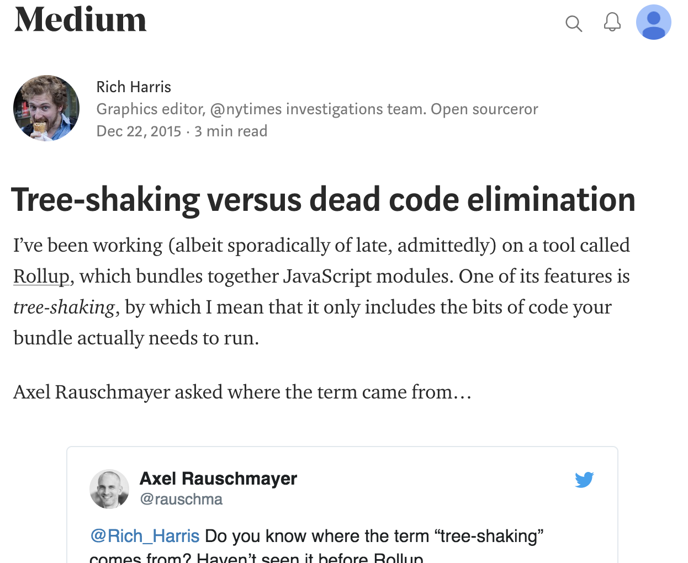

# Bundling JavaScript
## The Good, the Dead and the Ugly Code

Lukas Taegert 
TNG Technology Consulting, 2018-05-04
<a href="https://www.tngtech.com/"></img></a>

[[

@audience:
- Works with JS? Webpack? Rollup?
- Own involvement
- Maybe you should, why you should, what's special about R

---

<a href="https://nolanlawson.com/2016/08/15/the-cost-of-small-modules">

nolanlawson.com/2016/08/15/the-cost-of-small-modules

</a>

[[

Nolan Lawson, Microsoft Edge team

---

# I
## A Short History of Bundling

[[

Part of the "JS Fatigue"

--

## Modular JavaScript

<svg class="full-size-svg section-appear" style="animation-delay:0.4s">
  <path d="M15,50 V88 h15 h-15 V158 h15 h-15 V228 h15 h-15 V298 h15 h-15 V368 h15 h-15 V438 h15 h-15 V500 l5,-20 l-5,10 l-5,-10 l5,20"
        pathLength="100" class="history-line section-selfdraw" style="animation-delay:0.6s" />

  <g>
    <text x="45" y="100" class="section-appear" style="animation-delay:0.8s;">
      IIFEs
    </text>
  </g>

  <g class="fragment none">
    <text x="45" y="170" class="section-appear group-highlight" style="animation-delay:1.0s;">
      CJS
    </text>
    <path d="M45,183 H300 V500 H750 V50 H300 V183"
          pathLength="100" class="history-line history-box group-selfdraw" />
    <foreignObject x="310" y="60" width="430" height="430" class="group-appear">
      

      Common JS
        
      Module format used by
       
      Node.js
      

    </foreignObject>
  </g>

  <g>
    <text x="45" y="240" class="section-appear" style="animation-delay:1.2s;">
      AMD
    </text>
  </g>

  <g>
    <text x="45" y="310" class="section-appear" style="animation-delay:1.4s;">
      UMD
    </text>
  </g>

  <g class="fragment none">
    <text x="45" y="380" class="section-appear group-highlight" style="animation-delay:1.6s;">
      ESM
    </text>
    <path d="M45,393 H300 V500 H750 V50 H300 V393"
          pathLength="100" class="history-line history-box group-selfdraw" />
    <foreignObject x="310" y="60" width="430" height="430" class="group-appear">
      

      ECMAScript
      Modules
        
      Native JS module format
        
      (introduced with ECMAScript 2015)
      

    </foreignObject>
  </g>

  <g>
    <text x="45" y="450" class="section-appear" style="animation-delay:1.8s;">
      SystemJS
    </text>
  </g>
</svg>

--

## Modules are bad for performance

Fewer requests <svg class="right-arrow-svg">
  <path d="M5,15 h30 l-2,-10 l15,20 l-15,20 l2,-10 h-30"
        pathLength="100" class="history-line svg-selfdraw" style="animation-delay:0.6s;"/>
</svg> Faster loading
<svg style="display:block; width:800px; height:400px; margin:20px auto">
  <text x="300" y="80" text-anchor="end" class="section-appear" style="animation-delay:0.8s;">jquery.js</text>
  <text x="300" y="140" text-anchor="end" class="section-appear" style="animation-delay:1.0s;">angular.js</text>
  <text x="300" y="200" text-anchor="end" class="section-appear" style="animation-delay:1.2s;">lodash.js</text>
  <text x="300" y="260" text-anchor="end" class="section-appear" style="animation-delay:1.4s;">app.js</text>
  <text x="300" y="320" text-anchor="end" class="section-appear" style="animation-delay:1.6s;">…</text>
  <g class="fragment none">
    <path d="M360,40 h20 V185 h30 l-2,-10 l15,20 l-15,20 l2,-10 h-30 V340 h-20"
          pathLength="100" class="history-line group-selfdraw" />
    <text x="480" y="200" class="group-appear" style="animation-delay:0.6s;">bundle.js</text>
  </g>
</svg>

--

## Tooling

<svg class="full-size-svg section-appear" style="animation-delay:0.4s">
  <path d="M15,50 V120 h15 h-15 V260 h15 h-15 V400 h15 h-15 V500 l5,-20 l-5,10 l-5,-10 l5,20"
        pathLength="100" class="history-line section-selfdraw" style="animation-delay:0.6s" />

  <g class="fragment none">
    <text x="45" y="132" class="section-appear group-highlight" style="animation-delay:0.8s;">
      Browserify
    </text>
    <path d="M45,145 H300 V500 H750 V50 H300 V145"
          pathLength="100" class="history-line history-box group-selfdraw" />
    <foreignObject x="310" y="60" width="430" height="430" class="group-appear">
      

      
      Bundles CJS modules
        
      Includes emulated Node runtime loader
      

    </foreignObject>
   </g>

  <g class="fragment none">
    <text x="45" y="272" class="section-appear group-highlight" style="animation-delay:1.0s;">
      Webpack
    </text>
    <path d="M45,285 H300 V500 H750 V50 H300 V285"
          pathLength="100" class="history-line history-box group-selfdraw" />
    <foreignObject x="310" y="60" width="430" height="430" class="group-appear">
      

      
      Bundles CJS, AMD,
      ESM
        
      Includes custom runtime loader
      

    </foreignObject>
  </g>

  <g class="fragment none">
    <text x="45" y="412" class="section-appear group-highlight" style="animation-delay:1.2s;">
      Rollup
    </text>
    <path d="M45,425 H300 V500 H750 V50 H300 V425"
          pathLength="100" class="history-line history-box group-selfdraw" />
    <foreignObject x="310" y="60" width="430" height="430" class="group-appear">
      

      
      Bundles ESM modules
        
      NO RUNTIME LOADER!
      

    </foreignObject>
  </g>
</svg>

---

# II
## Rollup or The Beauty of ESM

--

<!-- .slide: data-transition="slide" -->
## Why no runtime loader?

<h3 class="section-appear" style="animation-delay:0.4s">Execution order</h3>
<table class="section-appear" style="animation-delay:0.6s">
  <tr>
    <th>CJS: dynamic</th>
    <th class="section-appear" style="animation-delay:1.2s">ESM: statically known</th>
  </tr>
  <tr>
    <td class="section-appear" style="animation-delay:0.8s">
    `main.js`
    <pre class="section-appear" style="animation-delay:1.0s"><code class="lang-javascript hljs">const x = 1;
const y = require('./other.js');
console.log(x, y);</code></pre></td>
    <td class="section-appear" style="animation-delay:1.4s">
    `main.js`
    <pre class="section-appear" style="animation-delay:1.6s"><code class="lang-javascript hljs">const x = 1;
import {y} from './other.js';
console.log(x, y);</code></pre></td>
  </tr>
  <tr class="fragment" data-fragment-index="1">
    <td><ol>
      <li>`const x = 1`</li>
      <li class="fragment highlight-red" data-fragment-index="2">`<Execute other.js>`</li>
      <li>`const y = ...`</li>
      <li>`console.log(x,y)`</li>
    </ol></td>
    <td class="fragment" data-fragment-index="3"><ol>
      <li class="fragment highlight-red" data-fragment-index="4">`<Execute other.js>`</li>
      <li>`<Import y>`</li>
      <li>`const x = 1`</li>
      <li>`console.log(x,y)`</li>
    </ol></td>
  </tr>
</table>

--

<!-- .slide: data-transition="slide" -->
## Why no runtime loader?

<h3 class="section-appear" style="animation-delay:0.4s">Live bindings</h3>
<table class="section-appear" style="animation-delay:0.6s">
  <tr>
    <th>CJS</th>
    <th class="section-appear" style="animation-delay:1.4s">ESM</th>
  </tr>
  <tr>
    <td class="section-appear" style="animation-delay:0.8s">
    `main.js`
    <pre class="section-appear" style="animation-delay:1.0s"><code class="lang-javascript hljs">const y = require('./other.js');
setTimeout(() =>
  console.log(y), 2000);</code></pre>
    `other.js`
    <pre class="section-appear" style="animation-delay:1.2s"><code class="lang-javascript hljs">module.exports = 1;
setTimeout(() =>
  module.exports = 2, 1000);</code></pre>
    </td>
    <td class="section-appear" style="animation-delay:1.6s">
    `main.js`
    <pre class="section-appear" style="animation-delay:1.8s"><code class="lang-javascript hljs">import {y} from './other.js';
setTimeout(() =>
  console.log(y), 2000);</code></pre>
    `other.js`
    <pre class="section-appear" style="animation-delay:2.0s"><code class="lang-javascript hljs">export let y = 1;
setTimeout(() => y = 2, 1000);</code></pre>
    </td>
  </tr>
  <tr class="fragment">
    <td>
      Output: `"1"`
    </td>
    <td class="fragment">
      Output: `"2"`
    </td>
  </tr>
</table>

--

<!-- .slide: data-transition="slide" -->
## Scope hoisting

  `main.js`
  <pre class="section-appear" style="animation-delay:0.6s"><code id="scope-hoisting-in-2" contenteditable class="lang-javascript hljs">import {y} from './other.js';
setTimeout(() =>
  console.log(y), 2000);</code></pre>
  `other.js`
  <pre class="section-appear" style="animation-delay:0.8s"><code id="scope-hoisting-in-1" contenteditable class="lang-javascript hljs">export let y = 1;
setTimeout(() => y = 2, 1000);</code></pre>

  <button class="rollup-button" onclick="rollupToBlock({
      './other.js': 'scope-hoisting-in-1',
      './main.js': 'scope-hoisting-in-2'
    },
    './main.js',
    'scope-hoisting-out')">
    <svg style="width:105px;height:60px">
      <image x="0" y="0" height="60px" href="img/rollup.svg" class="rollup-button-image" style="animation-delay:1.2s"/>
      <path d="M70,10 v30 l-10,-2 l20,15 l20,-15 l-10,2 v-30"
            pathLength="100" class="history-line rollup-button-line" style="animation-delay:1.4s;"/>
    </svg>
  </button>
  `bundle.js`
  <pre class="section-appear" style="animation-delay:1.6s"><code id="scope-hoisting-out" class="lang-javascript hljs"></code></pre>

--

No reassigned exports, 
shared variables across modules

<svg class="down-arrow-svg">
  <path d="M15,5 v30 l-10,-2 l20,15 l20,-15 l-10,2 v-30"
        pathLength="100" class="history-line svg-selfdraw" style="animation-delay:0.4s;"/>
</svg>

Better dead code elimination?

---

# III
## Tree-shaking

--

<a href="https://medium.com/@Rich_Harris/tree-shaking-versus-dead-code-elimination-d3765df85c80">

medium.com/@Rich_Harris/ tree-shaking-versus-dead-code-elimination-d3765df85c80

</a>

[en.wikipedia.org/wiki/Tree_shaking](https://en.wikipedia.org/wiki/Tree_shaking)

--

<!-- .slide: data-transition="slide" -->
## Traditional DCE

<pre class="section-appear" style="display:inline-block; margin-right:300px;animation-delay:0.4s"><code class="lang-javascript hljs" data-noescape>import {getValue} from './y.js';No included usages

function unUsed() {}No usages

function ciruclar1(){circular2()}
function circular2(){ciruclar1()}

export let x;

if (true) {
  x = 'default';
} else {
  x = getValue();
}Dead branch</code></pre>

--

<!-- .slide: data-transition="slide" -->
## Tree-Shaking
("Mark-and-Sweep DCE")

<pre class="section-appear" style="display:inline-block; margin-right:300px;animation-delay:0.4s"><code class="lang-javascript hljs" data-noescape>import {getValue} from './getValue.js';

function unUsed() {}

function ciruclar1(){ circular2() }
function circular2(){ ciruclar1() }

export let x;Part of API

if (true) {
  x = 'default';
} else {Modifies included variable
  x = getValue();
}</code></pre></code></pre>

---

# IV
## Rolling it up

--

<!-- .slide: data-transition="slide" -->
## Let's bundle

  

    1. Parse code to AST, 
    create scope hierarchy, 
    collect declared variables, 
    bind identifiers to declarations; 
    repeat with discovered dependencies
  

  
  

    <svg class="down-arrow-svg" style="margin:0 auto">
      <path d="M15,5 v30 l-10,-2 l20,15 l20,-15 l-10,2 v-30"
            pathLength="100" class="history-line selfdraw"/>
    </svg>
    2. Link imports and exports across modules
  

  
  

    <svg class="down-arrow-svg" style="margin:0 auto">
      <path d="M15,5 v30 l-10,-2 l20,15 l20,-15 l-10,2 v-30"
            pathLength="100" class="history-line selfdraw"/>
    </svg>
    3. Mark external exports, 
    mark statements to be included (multi-pass)
  

  
  

    <svg class="down-arrow-svg" style="margin:0 auto">
      <path d="M15,5 v30 l-10,-2 l20,15 l20,-15 l-10,2 v-30"
            pathLength="100" class="history-line selfdraw"/>
    </svg>
    4. Render concatenated transformed modules
  

--

## Marking included statements

  <ul>
    <li class="section-appear" style="animation-delay:0.4s">Based on custom AST extensions:
      <ul>
        <li class="section-appear" style="animation-delay:0.6s">`ASTNode.hasEffects()`</li>
      </ul>
    </li>
    <li class="fragment" data-fragment-index="1">ca. summer 2017:
      <ul>
        <li class="fragment appear" data-fragment-index="1" style="animation-delay:0.4s">Only removed certain top-level statements</li>
        <li class="fragment" data-fragment-index="2">`CallExpression.hasEffects()`:
           Several hundred buggy lines of
           custom logic duplicating other code
        </li>
      </ul>
    </li>
  </ul>

--

<!-- .slide: data-transition="slide" -->
## Welcoming the Open-Closed-Principle

<ul>
  <li class="section-appear" style="animation-delay:0.4s">New effect types for expressions:
    <ul>
      <li class="section-appear" style="animation-delay:0.6s">`.hasEffectsWhenCalled()`</li>
      <li class="fragment" data-fragment-index="1">`.hasEffectsWhenAccessed()`</li>
    </ul>
  </li>
  <li class="fragment" data-fragment-index="2">New effect type for expressions and patterns:
    <ul>
      <li class="fragment appear" data-fragment-index="2" style="animation-delay:0.4s">`.hasEffectsWhenAssigned()`</li>
    </ul>
  </li>
</ul>

--

<!-- .slide: data-transition="slide" -->
## Checking for side-effects

  <pre class="section-appear" style="margin-right:300px;animation-delay:0.4s"><code class="lang-javascript hljs" data-noescape>export let x;Part of APIhasEffectsWhenAssigned?hasEffectsWhenAssigned: truehasEffectsWhenAssigned?hasEffectsWhenAssigned: true
let y;hasEffects: falsehasEffects: falsehasEffectsWhenAssigned?hasEffectsWhenAssigned: falsehasEffectsWhenAssigned?hasEffectsWhenAssigned: false

function doubleY() {hasEffects: falsehasEffects: falsehasEffectsWhenCalled?
  y = 2 * y;hasEffects?
}

function assignValues() {hasEffects: falsehasEffectsWhenCalled?
  x = 1;hasEffects?hasEffects?hasEffects: true
  y = 1;hasEffects?hasEffects: false
  doubleY();hasEffects?hasEffects: false
}

assignValues();hasEffects?hasEffects: true
</code></pre>
  
  
DonePass 21, second pass needed

--

## A foundation for new features

<ol>
  <li class="section-appear" style="animation-delay:0.4s">Value-Tracking</li>
  <li class="section-appear" style="animation-delay:0.6s">Object-Shape-Tracking</li>
  <li class="section-appear" style="animation-delay:0.8s">Function Return-Value-Tracking</li>
</ol>

--

<!-- .slide: data-transition="slide" -->
## 1. Value-Tracking

<ul>
  <li class="section-appear" style="animation-delay:0.4s">Separate Variable objects from declarations
    <ul>
      <li class="section-appear" style="animation-delay:0.6s">Variables track initial values and reassignments</li>
      <li class="fragment" data-fragment-index="1">A variable "value" is an AST node</li>
    </ul>
  </li>
  <li class="fragment" data-fragment-index="2">Due to performance considerations:
    <ul>
      <li class="fragment appear" data-fragment-index="2" style="animation-delay:0.4s">Value of reassigned variables is UNKNOWN_NODE</li>
    </ul>
  </li>
</ul>

--

<!-- .slide: data-transition="slide" -->
## Value-Tracking in action

  `main.js`
  <pre class="section-appear" style="animation-delay:0.6s"><code id="value-tracking-in" contenteditable class="lang-javascript hljs">console.log('effect');

let x = 0;
const setX = globalVar
   ? () => x = 1
   : () => x = 2;
setX();

const a = [1, 2, 3];
const aString = a
  .map(v => 2 * v)
  .join();
</code></pre>

  <button class="rollup-button" onclick="rollupToBlock({
      './main.js': 'value-tracking-in'
    },
    './main.js',
    'value-tracking-out')">
    <svg style="width:105px;height:60px">
      <image x="0" y="0" height="60px" href="img/rollup.svg" class="rollup-button-image" style="animation-delay:0.8s" />
      <path d="M70,10 v30 l-10,-2 l20,15 l20,-15 l-10,2 v-30"
            pathLength="100" class="history-line rollup-button-line" style="animation-delay:1.0s;"/>
    </svg>
  </button>
  `bundle.js`
  <pre class="section-appear" style="animation-delay:1.4s"><code id="value-tracking-out" class="lang-javascript hljs"></code></pre>

--

<!-- .slide: data-transition="slide" -->
## 2. Object shape tracking

  

  Make new effects shape-aware:
  

  <ul>
    <li class="section-appear" style="animation-delay:0.6s">`hasEffectsWhenCalled``AtPath`</li>
    <li class="section-appear" style="animation-delay:0.8s">`hasEffectsWhenAccessed``AtPath`</li>
    <li class="section-appear" style="animation-delay:1.0s">`hasEffectsWhenAssigned``AtPath`</li>
  </ul>

--

<!-- .slide: data-transition="slide" -->
## Tracking member access

<pre class="section-appear" style="display:inline-block;margin-right:400px;animation-delay:0.4s"><code class="lang-javascript hljs" data-noescape>const obj = {
  nested: {
    x: () => {}hasEffectsWhenCalledAtPath([])?hasEffectsWhenCalledAtPath([]): false
  }hasEffectsWhenCalledAtPath(["x"])?
}hasEffectsWhenCalledAtPath(["nested", "x"])?
  
obj.nested.x();hasEffects?hasEffects: falsehasEffectsWhenCalledAtPath([])?hasEffectsWhenCalledAtPath(["x"])?hasEffectsWhenCalledAtPath(["nested", "x"])?
</code></pre>

--

<!-- .slide: data-transition="slide" -->
## 3. Return value tracking

<ul>
  <li class="section-appear" style="animation-delay:0.4s">Return statements register themselves on the function scope</li>
  <li class="fragment" data-fragment-index="1">Allows tree-shaking curried functions</li>
  <li class="fragment" data-fragment-index="2">New method: `someReturnExpressionWhenCalledAtPath()`</li>
</ul>

--

<!-- .slide: data-transition="slide" -->
## Tracking return values

<pre class="section-appear" style="display:inline-block;margin-right:400px;animation-delay:0.4s"><code class="lang-javascript hljs" data-noescape>function getValue(x) {
  if (x > 0) {
    return () => 1;hasEffectsWhenCalledAtPath([])?hasEffectsWhenCalledAtPath([]): false
  } else if (x === 0) {
    return () => 0;hasEffectsWhenCalledAtPath([])?hasEffectsWhenCalledAtPath([]): false
  }
  return undefined;hasEffectsWhenCalledAtPath([])?hasEffectsWhenCalledAtPath([]): true
}
const val = getValue(1)();hasEffects?hasEffectsWhenCalledAtPath([])?someReturnExpressionWhenCalledAtPath([],   hasEffectsWhenCalledAtPath([])?)?hasEffects: true
</code></pre>

--

## What's on the road map?

<ul>
  <li class="section-appear" style="animation-delay:0.4s">Extend known builtin globals</li>
  <li class="fragment" data-fragment-index="1">Object literal property tree-shaking</li>
  <li class="fragment" data-fragment-index="2">Value inlining</li>
  <li class="fragment appear" data-fragment-index="2" style="animation-delay:0.4s">…</li>
</ul>

---

# V
## Should you use Rollup?

--

<a href="https://medium.com/webpack/webpack-and-rollup-the-same-but-different-a41ad427058c">

medium.com/webpack/ webpack-and-rollup-the-same-but-different-a41ad427058c

</a>

--

<!-- .slide: data-transition="slide" -->
## Built for optimizing libraries

- <!-- .element class="section-appear" style="animation-delay:0.4s" -->Many supported output formats: 
  IIFE,  CJS, AMD, UMD, ESM, SystemJS
- <!-- .element class="fragment" -->Readable output: 
  Preserves original formatting
- <!-- .element class="fragment" -->Preserves annotations and other comments
- <!-- .element class="fragment" -->No runtime loader overhead!

--

<!-- .slide: data-transition="slide" -->
## Rich plugin ecosystem

  
<a href="https://github.com/rollup/rollup/wiki/Plugins">github.com/rollup/rollup/wiki/Plugins</a>

  <ul>
    <li class="section-appear" style="animation-delay:0.6s">CJS, AMD module import</li>
    <li class="section-appear" style="animation-delay:0.8s">Babel, Uglify, Closure Compiler</li>
    <li class="section-appear" style="animation-delay:1.0s">TypeScript, Elm, ReasonML/OCaml, WebAssembly</li>
    <li class="section-appear" style="animation-delay:1.2s">In memory bundling via plugin (even in browsers!)</li>
    <li class="section-appear" style="animation-delay:1.4s">Import code from markdown documents</li>
    <li class="section-appear" style="animation-delay:1.6s">…</li>
  </ul>

--

## Trusted by some of the best

React,
Vue,
Ember,
Angular, 
D3,
Three.js,
Moment, 
Jest,
Prettier,
Bootstrap, 
Babylon,
Leaflet…

--

<!-- .slide: data-transition="slide" -->
## What about web apps?

<ul>
  <li>Plugins for CSS, LESS, SASS</li>
  <li class="section-appear" style="animation-delay:0.6s">Dev server plugin (combines nicely with watch mode)</li>
  <li class="section-appear" style="animation-delay:0.8s">HTML template plugin</li>
</ul>

But there is more…

--

<!-- .slide: data-transition="slide" -->
## Code-Splitting (new!)

  <ul>
    <li class="section-appear" style="animation-delay:0.8s">No code duplication</li>
    <li class="fragment" data-fragment-index="1">Still no runtime loader!
      <ul class="fragment appear" data-fragment-index="1" style="animation-delay:0.4s">
        <li>bring your own AMD/SystemJS loader, 
            or use ES6 modules in modern browsers, 
            CJS modules in Node)
        </li>
      </ul>
    <li class="fragment" data-fragment-index="2">Dynamic "`import(…)`" support</li>
    <li class="fragment" data-fragment-index="3">Dependency-content-aware hashes in file names</li>
    <li class="fragment appear" data-fragment-index="3" style="animation-delay:0.4s">…</li>
  </ul>

---

# VI
## The core team

--

<!-- .slide: data-transition="slide" -->
## Rich-Harris

 <!-- .element class="section-appear" style="float:left; height: 300px; animation-delay:0.4s" -->

- <!-- .element class="section-appear" style="animation-delay:0.6s" -->Created Rollup in 2015
- <!-- .element class="section-appear" style="animation-delay:0.8s" -->Journalist and creator of *countless* JS frameworks (check out Svelte!)

--

<!-- .slide: data-transition="slide" -->
## Guy Bedford

 <!-- .element class="section-appear" style="float:left; height: 300px; animation-delay:0.4s" -->

- <!-- .element class="section-appear" style="animation-delay:0.6s" -->Created SystemJS and JSPM
- <!-- .element class="section-appear" style="animation-delay:0.8s" -->Brought code-splitting to Rollup
- <!-- .element class="section-appear" style="animation-delay:1.0s" -->Core team since Dec 2017

--

<!-- .slide: data-transition="slide" -->
## Lukas Taegert (i.e. myself)

 <!-- .element class="section-appear" style="float:left; height: 300px; animation-delay:0.4s" -->

- <!-- .element class="section-appear" style="animation-delay:0.6s" -->Refactored tree-shaking since Jul 2017
- <!-- .element class="section-appear" style="animation-delay:0.8s" -->Core team since Sep 2017
- <!-- .element class="section-appear" style="animation-delay:1.0s" -->Released all versions of Rollup since Nov 2017

--

<!-- .slide: data-transition="slide" -->
## And countless contributors!

  Recent notable contributions: 
  <ul>
    <li  class="section-appear" style="animation-delay:0.6s">Kelly Selden: Module-preserving rendering
       to get tree-shaking for Ember.js
    </li>
    <li class="fragment">Sven Sauleau: Core web assembly support for
       Webpack and Rollup (in development)
    </li>
  </ul>

--

# Thank you!

Supported by <!-- .element: class="section-appear" style="animation-delay:0.4s; margin-top:60px" -->

